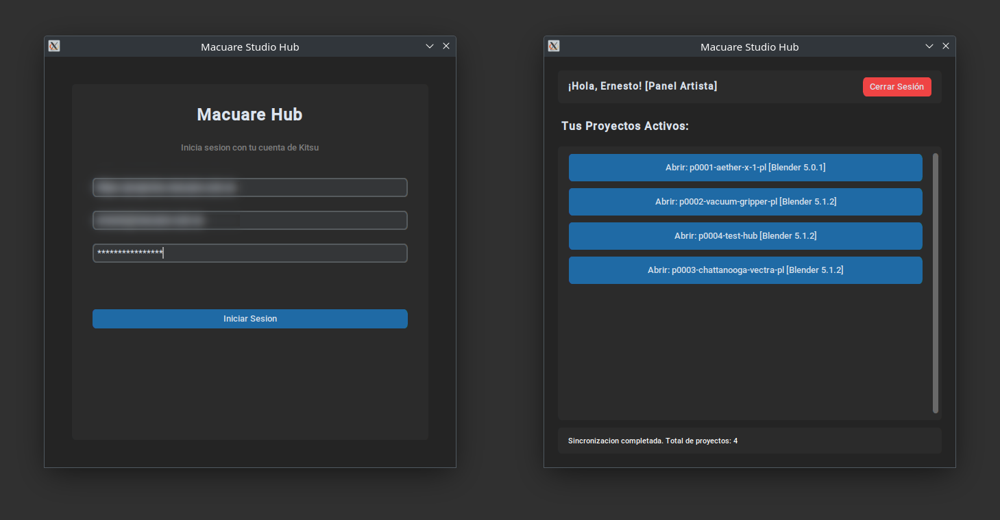

# Ernesto Del Valle M. | Technical Artist & Pipeline TD

[📄 Download Resume/CV](./assets/Ernesto_Del_Valle_CV.pdf)

Welcome to my technical art and pipeline portfolio. I specialize in bridging the gap between robust code architecture and artist-friendly environments to eliminate production bottlenecks, secure studio data, and optimize rendering pipelines.

## Profile Summary
* **Domain Expertise:** Pipeline Automation, DCC Tooling (Blender Python API), Advanced Procedural Systems (Geometry Nodes), Headless Render Optimization, and Asset/Environment Management workflows.
* **Core Tech Stack:** Python (`bpy`, `bmesh`), Bash Scripting, Core Render Engines (EEVEE, Cycles, UE5), Version Control (SVN, Git LFS), GUI Frameworks (CustomTkinter, Qt philosophy), and Studio APIs (Kitsu/Gazu).
* **Production Value:** Proven track record designing deterministic, data-driven automation frameworks that dramatically reduce downtime, safeguard art direction, and scale independent studio infrastructure.

---

## Production Case Studies

---

### [Case Study 1: Procedural Trabecular Generator](./trabeculas.md)
  
**Focus:** *Procedural Content Generation & Spatial Math (Geometry Nodes)* An advanced biological asset generator built to replicate human bone microarchitecture. Replaced days of unscalable manual sculpting with a lightweight, data-driven Voronoi scaffolding system that executes instant volumetric integration directly in the viewport.

[➡️ Read the full breakdown and see the node architecture](./trabeculas.md)

---

### [Case Study 2: "The Time Capsule" Environment Manager (Macuare Hub)](./launcher.md)
  
**Focus:** *Pipeline Infrastructure, Environment Isolation & JIT Security (Python / rez-like framework)* A standalone studio hub built to eliminate "dependency hell". The manager dynamically parses JSON manifests to inject isolated network paths, SVN repos, and specific Blender builds at runtime. Features an **In-Memory Credential Vault** and **Kitsu SSO** to secure passwords, creating an invisible, 100% backward-compatible sandbox for artists with a single click.

[➡️ Read the technical breakdown and view the architecture](./launcher.md)

---

### [Case Study 3: Art-Driven Render Pipeline (Historias Nativas)](./render-headless.md)

  <video width="600" controls autoplay loop muted playsinline preload="metadata" style="border-radius: 8px;">
    <source src="https://estudiomacuare.com/wp-content/uploads/atancha_360_export.mp4" type="video/mp4">
    Your browser does not support native video playback.
  </video>
  
<em>The "Painting with Polygons" effect: A complex, art-driven result requiring strict Render Layer separation and dynamic scene mutation at render time.</em>

**Focus:** *Render Pipeline Engineering, Headless Scene Mutation & Bash Orchestration* A robust render manager designed to support complex "Painting with Polygons" art direction. Implemented a hybrid Python/Bash pipeline to audit missing frames via logs, mutate scene data headlessly (toggling EEVEE/Cycles sub-frame settings and Z-Masks), and intelligently orchestrate batch rendering across local machines.

[➡️ Read the pipeline breakdown and audit the logic diagrams](./render-headless.md)

---
## Contact & Links
* **Email:** [edelvallemacuare@gmail.com](mailto:edelvallemacuare@gmail.com)
* **GitHub:** [https://github.com/3dvm](https://github.com/3dvm)
* **LinkedIn:** [https://www.linkedin.com/in/ernesto-del-valle-macuare/](https://www.linkedin.com/in/ernesto-del-valle-macuare/)
