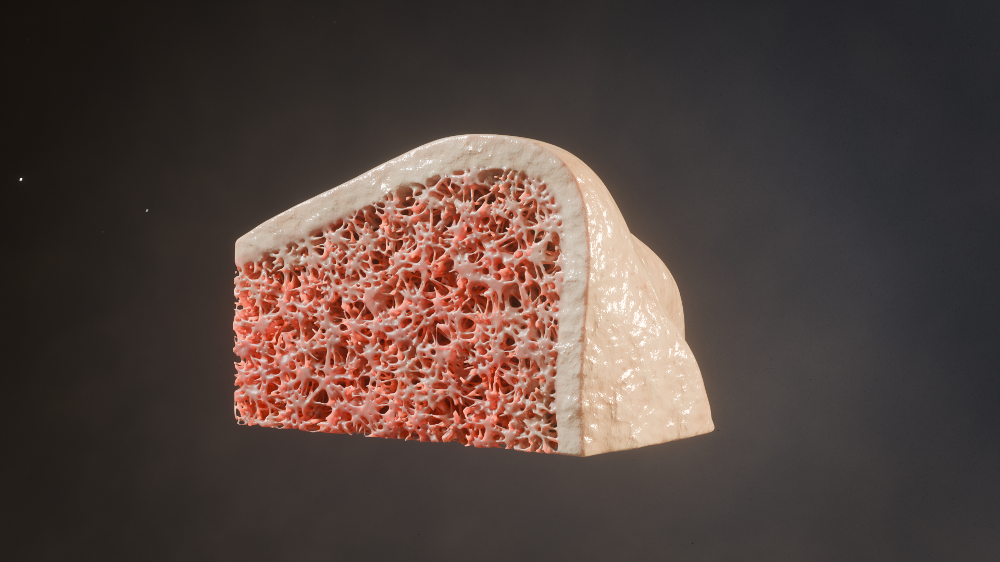
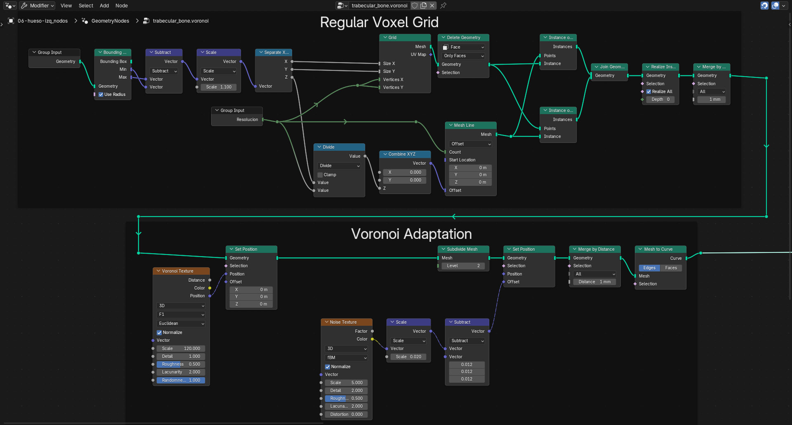

# Ernesto Del Valle | Technical Artist & Pipeline TD
**Portfolio & Case Studies** ---

## Case Study: Procedural Trabecular Bone Generator (MedTech Pipeline)
[← Back to Home](./)

*Click the image to watch the 60-second technical breakdown.*

---

### 1. The Problem: The Cost of Organic Complexity
Replicating nature’s geometry—specifically the internal trabecular microarchitecture (cancellous bone) of human anatomy—is computationally expensive. In traditional medical animation pipelines, attempting to manually sculpt or boolean thousands of microscopic struts is practically impossible, leading to destructive workflows, frozen viewports, and massive file sizes. 

The challenge was to create a system that could generate anatomical density dynamically, adapt to any bone shape, and seamlessly fuse with the solid outer cortical shell without manual intervention.

### 2. The Solution: A Data-Driven SDF Pipeline
Instead of relying on polygon modeling, I engineered a 100% procedural generator using Geometry Nodes. By implementing a spatial collapse algorithm to replicate the native Voronoi cellular matrix, the system guarantees physical accuracy before executing a final Signed Distance Field (SDF) integration into the bone wall.

#### Technical Deep Dive (The Node Architecture)

**Phase A: Volumetric Cellular Structuring**
To mimic the spongy look of bone marrow cavities, the system scatters points inside the target volume and evaluates them through a 3D Voronoi texture. By isolating the edges of these cellular fractures, we create the foundational wireframe of the trabeculae.

*> **Image 1:** Scattering logic and Voronoi edge isolation. Note the math nodes controlling the density threshold.*

**Phase B: SDF Conversion & Cortical Fusion**
Points and lines don't render. The wireframe is converted into a continuous volumetric grid (Points to SDF Volume). The critical step here is the boolean union between the internal trabecular volume and the external cortical bone shell, ensuring a biologically accurate, seamless transition rather than intersecting geometry.

*> **Image 2:** Converting the procedural skeleton into an SDF Grid. The voxel size is exposed to the modifier panel for LOD (Level of Detail) control.*

**Phase C: Surface Tension & Organic Smoothing**
Converting volumes back to meshes often results in blocky, voxelized artifacts. A custom smoothing iterative loop relaxes the geometry, recreating the natural surface tension and biological decay of real bone tissue.

*> **Image 3:** The Volume-to-Mesh conversion followed by the iterative smoothing node group, achieving the final organic look.*

---
### 3. Tools & Infrastructure

<table>
  <thead>
    <tr>
      <th style="text-align: left">Category</th>
      <th style="text-align: left">Technology Used</th>
    </tr>
  </thead>
  <tbody>
    <tr>
      <td><strong>Engine</strong></td>
      <td>Blender 3D</td>
    </tr>
    <tr>
      <td><strong>Framework</strong></td>
      <td>Geometry Nodes (Node-based procedural architecture)</td>
    </tr>
    <tr>
      <td><strong>Core Math</strong></td>
      <td>Signed Distance Fields (SDF), Voronoi spatial clustering, Boolean Volume logic</td>
    </tr>
  </tbody>
</table>

### 4. Impact & Pipeline Metrics
* **Time Efficiency:** Reduced asset creation time from days of manual sculpting to real-time, instant procedural generation.
* **Non-Destructive Workflow:** Artists can change the base bone shape, and the internal trabeculae automatically recalculate and adapt.
* **Performance:** Infinite scalability. Bypassing heavy mesh booleans in favor of SDF math prevents viewport crashes and keeps the `.blend` file size minimal.

---
[← Back to Main Portfolio](./)
